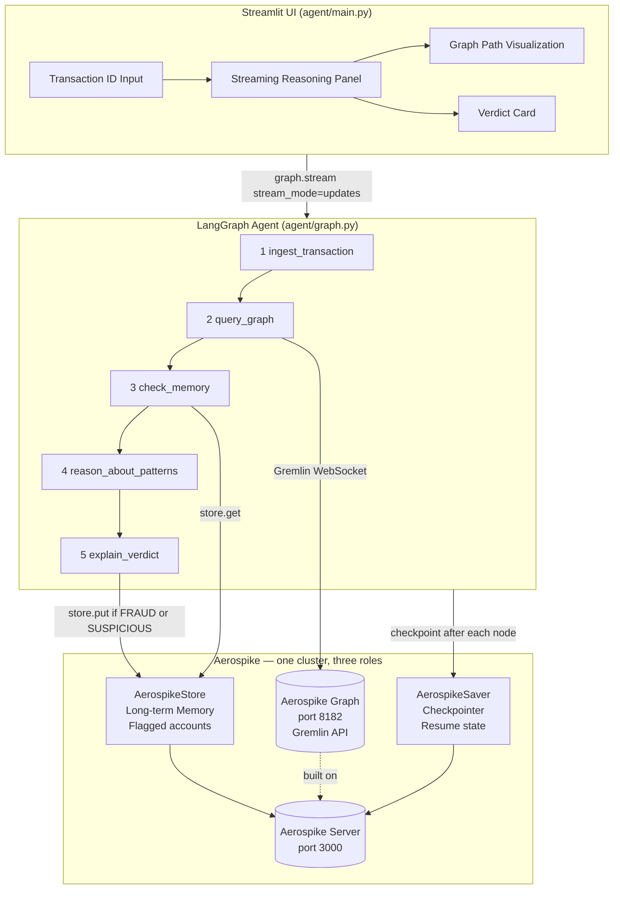

# fraud-investigator-agent

A LangGraph agent that investigates suspicious financial transactions by traversing an Aerospike Graph, reasoning about fraud patterns with Claude, and persisting investigation state and cross-session memory — all in Aerospike.

---

## Architecture



---

## Why Aerospike

| Need | Aerospike | Alternative |
|---|---|---|
| Graph traversal at fraud-detection write volumes | Aerospike Graph — sub-millisecond reads, horizontal scale | Neo4j — not designed for high-throughput transactional writes |
| Agent checkpoint persistence across restarts | `AerospikeSaver` — durable by default, scales out | SQLite — single-process, no HA; Redis — requires AOF config for durability |
| Cross-session long-term memory | `AerospikeStore` — record-level TTL built in, no cleanup scripts | Redis — requires separate TTL management; Postgres — no native graph |
| Operational simplicity | **One Aerospike cluster** serves all three roles | Three separate systems: Neo4j + Redis + Postgres |

Aerospike's record-level TTL means flagged account memories can automatically expire after 90 days — set `ttl=7776000` on `store.put()` calls. No cron jobs, no cleanup scripts.

---

## Local Setup

### Prerequisites
- Docker + Docker Compose
- Python 3.11+
- An [Anthropic API key](https://console.anthropic.com/)

### 1. Clone and configure

```bash
git clone https://github.com/inchara08/fraud-investigator-agent.git
cd fraud-investigator-agent

cp .env.example .env
# Edit .env and add your ANTHROPIC_API_KEY
```

### 2. Start Aerospike

```bash
docker compose up -d
docker compose ps
```

Both `aerospike` and `aerospike-graph` should show **healthy**.

> **License issue?** If `aerospike-graph` exits immediately, try adding `ACCEPT_EULA: "Y"` to its environment in `docker-compose.yml`. Alternatively, switch to dev mode (see below).

#### Dev mode (no license required)

In `docker-compose.yml`, comment out the `aerospike-graph` service and uncomment `gremlin-server`. The Gremlin queries are identical — only the backing store differs.

### 3. Install Python dependencies

```bash
python -m venv .venv
source .venv/bin/activate
pip install -r requirements.txt
```

### 4. Seed the graph

```bash
python data/seed_data.py
```

Expected output:
```
Seeding 4 demo scenarios (idempotent — safe to run multiple times):
  Seeding tx_clean_001 (CLEAN scenario)...
  Seeding tx_fraud_001 (FRAUD scenario)...
  Seeding tx_subtle_001 (SUSPICIOUS/subtle scenario)...
  Seeding tx_fp_001 (false positive scenario)...

Done. Total vertices in graph: 16
```

Run it twice — vertex count stays at 16 (idempotent).

### 5. Launch the UI

```bash
streamlit run agent/main.py
```

Open [http://localhost:8501](http://localhost:8501).

---

## Demo Scenarios

### Scenario 1 — Clean transaction (`tx_clean_001`)

**Graph:** Alice initiates a $49.99 retail purchase at Amazon. Bob receives funds. No flagged accounts anywhere in the graph.

**Expected verdict:** `CLEAN` (~0.95 confidence)

**What to observe:** The `check_memory` node finds no prior flags. The `reason_about_patterns` node sees no risk signals. Verdict card renders green.

---

### Scenario 2 — Obvious fraud (`tx_fraud_001`)

**Graph:** Carol — flagged for `money_laundering` — directly initiates a $9,800 wire transfer to a shell company.

**Expected verdict:** `FRAUD` (~0.98 confidence)

**What to observe:** The `query_graph` node returns Carol in the direct 1-hop neighborhood with `is_flagged=True`. The right panel shows Carol's vertex with a 🚨 marker. Verdict card renders red.

---

### Scenario 3 — Subtle fraud (`tx_subtle_001`)

**Graph:** Dave initiates a transaction to Cayman Settlements Ltd. Eve (flagged for `structuring`) also transacted with the same merchant previously. Dave and Eve are not directly linked — the connection is 2 hops via the shared merchant.

**Expected verdict:** `SUSPICIOUS` (~0.70 confidence)

**What to observe:** The `query_graph` node's multi-hop traversal surfaces the 2-hop path through `merchant_offshore`. The `reason_about_patterns` node explains the indirect link. Verdict card renders orange.

---

### Scenario 4 — False positive (`tx_fp_001`)

**Graph:** Frank initiates a $120 grocery purchase. Frank shares a device with Grace, who is historically flagged — but Grace's `flag_reason` is `resolved_dispute`.

**Expected verdict:** `SUSPICIOUS` (~0.55–0.60 confidence, with explanation noting the flag is resolved)

**What to observe:** The agent finds the shared device connection and Grace's flag, but the `reason_about_patterns` node correctly identifies `resolved_dispute` as a mitigating factor and downgrades the risk. Demonstrates that the agent reads flag context, not just flag presence.

---

### Cross-session memory demo

Run `tx_fraud_001` first (Carol gets persisted to `AerospikeStore`).

Then run `tx_subtle_001`. If any accounts overlap (possible depending on your graph), the `check_memory` node will surface Carol's prior flag from the store — even though this is a fresh investigation of a different transaction.

The `check_memory` node output in the center panel will show:
```
Memory recall: 1 account(s) from this graph were previously flagged: ['acc_carol']
```

This is cross-session memory — the agent remembers Carol was flagged in a prior run, even after Streamlit was restarted.

---

### Resume demo (checkpoint recovery)

This demonstrates `AerospikeSaver` — the agent can resume from the last checkpoint after an interruption.

1. Start investigating `tx_fraud_001`
2. After the `2️⃣ Query Graph` expander appears (but before the investigation finishes), kill Streamlit with **Ctrl+C**
3. Restart: `streamlit run agent/main.py`
4. Re-enter `tx_fraud_001` and click **Investigate**

**What happens:** The agent resumes from the `3️⃣ Check Memory` node. It does **not** re-run `ingest_transaction` or `query_graph` — those checkpoints were already persisted to Aerospike under thread ID `fraud-tx_fraud_001`.

This works because every node's output is checkpointed to Aerospike before the next node begins. On resume, LangGraph reads the latest checkpoint and continues from where execution stopped.

---

## Verification Checklist

```bash
# 1. Infrastructure
docker compose up -d && docker compose ps

# 2. Seed data (idempotent)
python data/seed_data.py
python data/seed_data.py  # run twice — vertex count should not change

# 3. Aerospike connectivity
python -c "from agent.memory import get_aerospike_client; c = get_aerospike_client(); print('Aerospike OK')"

# 4. Agent invoke (no UI)
python - <<'EOF'
import os; os.environ.setdefault("ANTHROPIC_API_KEY", os.getenv("ANTHROPIC_API_KEY", ""))
from agent.memory import get_aerospike_client, get_checkpointer, get_store
from agent.graph import build_fraud_graph
client = get_aerospike_client()
graph = build_fraud_graph(get_checkpointer(client), get_store(client))
result = graph.invoke(
    {"transaction_id": "tx_fraud_001", "investigation_complete": False, "messages": [],
     "graph_context": None, "memory_context": None, "verdict": None, "confidence": None,
     "explanation": None, "graph_path": None, "risk_factors": None},
    {"configurable": {"thread_id": "verify-fraud-001"}}
)
print("Verdict:", result["verdict"], "| Confidence:", result["confidence"])
EOF

# 5. UI
streamlit run agent/main.py
# Then test all 4 demo scenarios

# 6. Cross-session memory
# Run tx_fraud_001, then tx_subtle_001 — check_memory node should recall acc_carol

# 7. Resume demo
# Follow the Resume Demo section above
```

---

## Project Structure

```
fraud-investigator-agent/
├── docker-compose.yml      # Aerospike CE + Aerospike Graph (or TinkerPop fallback)
├── requirements.txt
├── .env.example
├── agent/
│   ├── graph.py            # LangGraph state machine — 5 nodes, linear flow
│   ├── tools.py            # Gremlin query functions + AerospikeStore helpers
│   ├── memory.py           # Aerospike client factory (AerospikeSaver + AerospikeStore)
│   ├── prompts.py          # System prompt + reasoning prompt template
│   └── main.py             # Streamlit entrypoint
└── data/
    └── seed_data.py        # 4 demo scenarios (idempotent mergeV/mergeE seeding)
```
