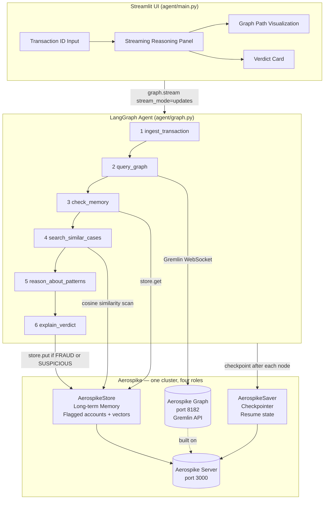

# Fraud Investigator Agent

**Graph-native fraud investigation powered by multi-hop reasoning and persistent agent memory.**

   

---

## Overview

Fraudulent transactions rarely look suspicious in isolation — the risk hides in who the sender has transacted with, which devices are shared, and which accounts appeared in prior investigations. This system traverses a live transaction graph up to 3 hops deep, reasons over the discovered subgraph with an LLM, recalls flagged entities from previous investigations, and surfaces semantically similar past cases — all before issuing a structured verdict with confidence score and risk factors.

A single Aerospike cluster handles all persistence roles: the transaction graph (Gremlin), agent checkpoints (AerospikeSaver), cross-session memory (AerospikeStore), and pattern vector storage — eliminating operational complexity without sacrificing scale.

---

## Key Features

- **Multi-hop graph traversal** — Gremlin queries traverse up to 3 hops with cycle prevention (`simplePath()`), surfacing indirect connections invisible to row-level ML models
- **LLM-powered reasoning** — Gemini 2.5-Flash reasons over raw graph context, memory hits, and similar cases; temperature=0 for deterministic, auditable outputs
- **Cross-session memory** — AerospikeStore persists flagged account IDs with native record-level TTL (90-day auto-expiry, no cron jobs)
- **Vector similarity search** — 768-dim pattern embeddings enable retrieval of semantically similar past cases at investigation time
- **Durable checkpoint/resume** — AerospikeSaver persists state after every node; interrupted investigations resume from the exact node they stopped at
- **Structured verdict output** — Pydantic-enforced `FraudVerdict`: `FRAUD | SUSPICIOUS | CLEAN`, confidence score, prose explanation, and enumerated risk factors
- **Real-time reasoning UI** — Streamlit streams each agent node's output as it executes, exposing the full reasoning chain to investigators

---

## Architecture



### Agent Nodes

| # | Node | Role |
|---|------|------|
| 1 | `ingest_transaction` | Validates the transaction exists; returns `ERROR` and halts if not found |
| 2 | `query_graph` | 1-hop context fetch + recursive multi-hop traversal to find flagged accounts |
| 3 | `check_memory` | Batch-queries AerospikeStore for any accounts in the current graph previously flagged |
| 4 | `search_similar_cases` | Embeds the current pattern, retrieves top-3 similar past cases by cosine similarity |
| 5 | `reason_about_patterns` | LLM synthesizes all signals: direct flags, indirect paths, memory hits, similar cases |
| 6 | `explain_verdict` | Structured output → `FraudVerdict`; persists flagged accounts and pattern vector to store |

### System Design

```
┌─────────────────────────────────────────────────────────────────┐
│                       INPUT INGESTION                            │
│   Transaction ID ──▶ validate in graph ──▶ early-exit on miss   │
└──────────────────────────────┬──────────────────────────────────┘
                               │
                               ▼
┌─────────────────────────────────────────────────────────────────┐
│                      SIGNAL EXTRACTION                           │
│                                                                  │
│  ┌───────────────────┐  ┌──────────────────┐  ┌─────────────┐  │
│  │  Graph Traversal  │  │  Memory Recall   │  │ Case Search │  │
│  │  1-hop context    │  │  AerospikeStore  │  │ 768-dim     │  │
│  │  + 3-hop paths    │  │  flagged accts   │  │ cosine sim  │  │
│  │  (Gremlin/        │  │  (90-day TTL)    │  │ top-3 cases │  │
│  │   TinkerPop)      │  │                  │  │             │  │
│  └───────────────────┘  └──────────────────┘  └─────────────┘  │
└──────────────────────────────┬──────────────────────────────────┘
                               │
                               ▼
┌─────────────────────────────────────────────────────────────────┐
│                      AGENT REASONING                             │
│   Gemini 2.5-Flash (temp=0) · graph + memory + similar cases    │
│   Output: structured reasoning trace (auditable, streamable)    │
└──────────────────────────────┬──────────────────────────────────┘
                               │
                               ▼
┌─────────────────────────────────────────────────────────────────┐
│                    EVIDENCE AGGREGATION                          │
│   LangGraph state: graph_context · memory_context ·             │
│   similar_cases · messages — unified input to verdict node      │
└──────────────────────────────┬──────────────────────────────────┘
                               │
                               ▼
┌─────────────────────────────────────────────────────────────────┐
│                      DECISION OUTPUT                             │
│   verdict: FRAUD · SUSPICIOUS · CLEAN  |  confidence: 0.0–1.0  │
│   risk_factors: [...]  |  explanation: prose for compliance     │
│   ── persists to AerospikeStore if FRAUD or SUSPICIOUS          │
│   ── streams to Streamlit UI (verdict card + reasoning trace)   │
└─────────────────────────────────────────────────────────────────┘
```

#### Component Breakdown

**Input Ingestion** — `ingest_transaction`
Validates the transaction ID against Aerospike Graph before any computation begins. Invalid or unknown IDs return an `ERROR` verdict immediately — no LLM calls, no graph queries.

**Signal Extraction** — `query_graph` · `check_memory` · `search_similar_cases`
Three independent signal sources feed into the reasoning layer:
- *Graph Traversal*: Gremlin fetches a 1-hop neighborhood (accounts, merchants, devices) then recursively traverses up to 3 hops to surface flagged entities, using `simplePath()` to prevent cycles.
- *Memory Recall*: Batch-reads AerospikeStore for any accounts in the current graph flagged in prior investigations. Records auto-expire after 90 days via native Aerospike TTL — no cleanup scripts required.
- *Case Search*: Encodes the current transaction's behavioral pattern as a 768-dim vector and retrieves the 3 most semantically similar past cases using cosine similarity.

**Agent Reasoning** — `reason_about_patterns`
Gemini 2.5-Flash receives the raw graph subgraph, memory hits, and retrieved cases in a single structured prompt. At `temperature=0` it produces a deterministic, auditable reasoning trace — explaining which signals it weighted and why — streamed to the UI as it generates.

**Evidence Aggregation** — `FraudInvestigationState`
The LangGraph `TypedDict` state accumulates outputs from all prior nodes: `graph_context`, `memory_context`, `similar_cases`, and the full `messages` list. Passed as a unified object to the verdict node — no signal is silently dropped between steps.

**Decision Output** — `explain_verdict`
Structured output mode enforces a `FraudVerdict` Pydantic schema: `verdict`, `confidence`, `explanation`, `graph_path_summary`, and `risk_factors`. FRAUD and SUSPICIOUS verdicts are written to AerospikeStore (with verdict, reason, and timestamp) for future memory recall. The complete result streams to the Streamlit verdict card.

---

## Example Workflow

**Input:** `tx_subtle_001` — Dave transacts with an offshore merchant. No direct red flags.

```
[ingest_transaction]
  ✓ Transaction tx_subtle_001 found in graph

[query_graph]
  Direct neighbors: dave (account), merchant_cayman (merchant)
  Multi-hop traversal (2 hops): dave → merchant_cayman → eve
    └─ eve: is_flagged=True, flag_reason=structuring

[check_memory]
  Memory recall: 0 accounts from this graph previously flagged

[search_similar_cases]
  Similar case 1: tx_fraud_003 (FRAUD, similarity=0.84) — offshore merchant + structuring link
  Similar case 2: tx_suspicious_007 (SUSPICIOUS, similarity=0.71) — 2-hop flagged account

[reason_about_patterns]
  Dave has no direct flag, but shares merchant_cayman with Eve (flagged: structuring).
  The 2-hop path dave → merchant_cayman → eve is a known structuring relay pattern.
  Matched 2 similar historical cases, one confirmed FRAUD. Risk elevated.

[explain_verdict]
  verdict:     SUSPICIOUS
  confidence:  0.72
  risk_factors:
    - 2-hop connection to flagged account (structuring)
    - Shared offshore merchant with known bad actor
    - Pattern similarity to confirmed fraud case (0.84)
  explanation: Dave is not directly flagged, but transacts with a merchant
               previously used by Eve, a structuring-flagged account. The
               indirect connection and historical pattern match warrant review.
```

---

## Tech Stack

| Component | Technology |
|-----------|------------|
| Agent Framework | [LangGraph](https://github.com/langchain-ai/langgraph) 0.6+ |
| LLM | Google Gemini 2.5-Flash (`temperature=0`, structured output) |
| Embeddings | `models/gemini-embedding-001` (768-dim) |
| Graph Database | Aerospike Graph — Gremlin/TinkerPop over WebSocket |
| Memory & Checkpoints | Aerospike KV — AerospikeSaver + AerospikeStore |
| Vector Search | Cosine similarity over Aerospike LIST bins (dev); AVS-ready |
| UI | Streamlit 1.35+ with streaming `graph.stream` |

### Why Aerospike

| Need | Aerospike | Alternative |
|---|---|---|
| Graph traversal at fraud-detection write volumes | Aerospike Graph — sub-millisecond reads, horizontal scale | Neo4j — not designed for high-throughput transactional writes |
| Agent checkpoint persistence | `AerospikeSaver` — durable by default, HA out of the box | SQLite — single-process, no HA |
| Cross-session long-term memory with TTL | `AerospikeStore` — record-level TTL, no cleanup scripts | Redis — requires separate TTL management |
| Operational simplicity | **One cluster** serves all four roles | Three separate systems: Neo4j + Redis + Postgres |

---

## Quick Start

### Prerequisites
- Docker + Docker Compose
- Python 3.11+
- Google AI API key (Gemini)

### 1. Clone and configure

```bash
git clone https://github.com/inchara08/fraud-investigator-agent.git
cd fraud-investigator-agent
cp .env.example .env
# Add GOOGLE_API_KEY to .env
```

### 2. Start Aerospike

```bash
docker compose up -d
docker compose ps  # aerospike and aerospike-graph should both show "healthy"
```

> If `aerospike-graph` exits immediately, add `ACCEPT_EULA: "Y"` to its environment in `docker-compose.yml`, or switch to dev mode by replacing the `aerospike-graph` service with `gremlin-server` (queries are identical).

### 3. Install dependencies

```bash
python -m venv .venv
source .venv/bin/activate
pip install -r requirements.txt
```

### 4. Seed the graph

```bash
python data/seed_data.py
# Expected: "Done. Total vertices in graph: 16"
# Idempotent — safe to run multiple times
```

### 5. Launch

```bash
streamlit run agent/main.py
# Open http://localhost:8501
```

---

## Demo Scenarios

| Transaction ID | Fraud Pattern | Expected Verdict | Confidence |
|----------------|--------------|-----------------|------------|
| `tx_clean_001` | Alice pays Amazon; no flagged accounts in graph | `CLEAN` | ~0.95 |
| `tx_fraud_001` | Carol (flagged: money_laundering) initiates $9,800 wire to shell company | `FRAUD` | ~0.98 |
| `tx_subtle_001` | Dave → offshore merchant ← Eve (flagged: structuring); 2-hop indirect link | `SUSPICIOUS` | ~0.70 |
| `tx_fp_001` | Frank shares a device with Grace (flagged: resolved_dispute); mitigating context | `SUSPICIOUS` | ~0.55–0.60 |

**Cross-session memory:** Run `tx_fraud_001` first (Carol is persisted to AerospikeStore). Then run `tx_subtle_001`. If graphs overlap, `check_memory` surfaces Carol's prior flag from the store — across a fresh Streamlit session.

**Checkpoint resume:** Start `tx_fraud_001`, kill Streamlit after the `query_graph` node completes, restart, and re-enter the same transaction ID. The agent resumes from `check_memory` — `ingest_transaction` and `query_graph` are not re-executed.

---

## Case Study — Coordinated Fraud Ring Detection

> **Operation Ghost Wire** — A $9,200 wire transfer that looks clean on its own. Six converging signals make it FRAUD.

### Scenario Overview

Marcus Chen initiates a late-night wire transfer to an offshore entity, Pacific Trade Solutions Ltd. The amount sits just below the $10,000 Currency Transaction Report threshold. Marcus has no fraud history. A row-level model clears him. The agent does not.

### Input Transaction

| Field | Value |
|-------|-------|
| Transaction ID | `tx_ring_001` |
| Sender | Marcus Chen (`acc_marcus`) |
| Amount | $9,200 USD |
| Recipient | Pacific Trade Solutions Ltd |
| Merchant Category | `wire_transfer` |
| Merchant Country | Cayman Islands |
| Timestamp | 2024-11-14 11:47 PM UTC |
| Account Age | 18 days |

### Discovered Graph

```
acc_marcus ──[INITIATED]──▶ tx_ring_001 ──[TO]──▶ merchant_pacific_trade
                                                            │
acc_marcus ──[USES]──▶ device_iphone_7a3f                  │ (shared merchant)
                               │                            │
                            [USES]                          ▼
                               │                  tx_prior_omar ──[INITIATED]──▶ acc_omar
                               ▼                              (FRAUD · money_laundering)
                          acc_nina
                    (SUSPICIOUS · structuring)
```

### Investigation Trace

**`1 · ingest_transaction`**
```
Transaction tx_ring_001 located in graph.
Sender:    acc_marcus  |  Amount: $9,200  |  Status: pending
Recipient: merchant_pacific_trade (Cayman Islands)
→ Proceeding to graph traversal.
```

**`2 · query_graph`**
```
1-hop neighborhood:
  · acc_marcus       account       is_flagged=False  risk_score=0.31
  · merchant_pacific_trade  merchant  country=KY  category=wire_transfer

Multi-hop traversal (up to 3 hops):
  Path A [2 hops]: acc_marcus → device_iphone_7a3f → acc_nina
    └─ acc_nina: is_flagged=True  flag_reason=structuring  risk_score=0.82

  Path B [3 hops]: acc_marcus → merchant_pacific_trade → tx_prior_omar → acc_omar
    └─ acc_omar: is_flagged=True  flag_reason=money_laundering  risk_score=0.97

→ 2 flagged entities discovered across 2 distinct paths.
```

**`3 · check_memory`**
```
Querying AerospikeStore for accounts in current graph...

Memory hit · acc_nina
  verdict:        SUSPICIOUS
  reason:         structuring
  flagged_at:     2024-11-09T14:22:00Z
  transaction_id: tx_nina_003

Memory hit · acc_omar
  verdict:        FRAUD
  reason:         money_laundering
  flagged_at:     2024-10-22T09:11:00Z
  transaction_id: tx_omar_007

→ 2 of 4 accounts in this graph carry active cross-session flags.
```

**`4 · search_similar_cases`**
```
Embedding current pattern: offshore wire_transfer + shared device + 2 flagged paths...
Running cosine similarity over pattern store (768-dim)...

Match 1 · tx_mule_2024_08   FRAUD       similarity: 0.91
  "Offshore Cayman wire, device shared with structuring account,
   sender account opened < 30 days"

Match 2 · tx_ring_2024_05   FRAUD       similarity: 0.87
  "Multi-hop money laundering path via shared merchant,
   amount below CTR threshold, newly opened account"

→ Both nearest neighbors are confirmed FRAUD cases.
```

**`5 · reason_about_patterns`**
```
Analyzing 6 signals across graph traversal, memory, and case history:

[SIGNAL 1] Device sharing (Path A, 2 hops)
  acc_marcus shares device_iphone_7a3f with acc_nina, an account actively
  flagged for structuring. Device sharing between accounts is a primary
  indicator of money mule coordination or account takeover.

[SIGNAL 2] Shared offshore merchant (Path B, 3 hops)
  merchant_pacific_trade has received funds from acc_omar, a confirmed
  money-laundering account. Using the same offshore entity as a known
  launderer places this merchant within an active laundering channel.

[SIGNAL 3] Cross-session memory — two active flags
  Both acc_nina (structuring) and acc_omar (money_laundering) were flagged
  in separate prior investigations. Their presence in this transaction's
  graph is not coincidental.

[SIGNAL 4] Structuring threshold avoidance
  $9,200 is a textbook structuring amount — deliberately below the $10,000
  CTR reporting threshold. Combined with the offshore destination, this is
  a high-confidence structuring indicator.

[SIGNAL 5] Newly opened account (18 days)
  Accounts opened within 30 days and used immediately for offshore wire
  transfers are a strong mule network indicator. acc_marcus fits this profile.

[SIGNAL 6] Historical pattern match
  Two of the three nearest historical cases are confirmed FRAUD with
  similarity scores of 0.91 and 0.87. The current pattern is nearly
  identical to known fraud ring activity.

Assessment: Six independent signals converge on the same conclusion.
Marcus Chen's account exhibits the hallmarks of a coordinated money mule
operation. No signal in isolation is conclusive; together, they are.
```

**`6 · explain_verdict`**
```
┌─────────────────────────────────────────────────────────────────┐
│  VERDICT      FRAUD                                             │
│  CONFIDENCE   0.94                                              │
├─────────────────────────────────────────────────────────────────┤
│  RISK FACTORS                                                   │
│  · Shared device with structuring-flagged account (2-hop)       │
│  · 3-hop path to confirmed money-laundering account             │
│  · Offshore high-risk merchant (Cayman Islands, wire_transfer)  │
│  · Amount $9,200 — below $10,000 CTR reporting threshold        │
│  · Account age 18 days (mule network indicator)                 │
│  · Pattern match: 2 prior FRAUD cases, similarity ≥ 0.87        │
├─────────────────────────────────────────────────────────────────┤
│  EXPLANATION                                                    │
│  Marcus Chen's transaction presents six converging fraud        │
│  indicators. Device sharing with Nina (prior structuring flag)  │
│  and a shared offshore merchant with Omar (confirmed           │
│  laundering) place Marcus within a known mule network.          │
│  The $9,200 amount, 18-day account age, and strong historical  │
│  pattern match reinforce this assessment. Recommend immediate   │
│  account freeze and SAR filing.                                 │
└─────────────────────────────────────────────────────────────────┘

→ acc_marcus persisted to AerospikeStore (verdict: FRAUD, ttl: 90 days)
→ Pattern vector stored for future similarity matching
```

### Evidence Summary

| Signal | Source | Hops | Weight |
|--------|--------|------|--------|
| Shared device with Nina (structuring) | Graph traversal | 2 | High |
| Shared merchant with Omar (money_laundering) | Graph traversal | 3 | High |
| Nina active flag in cross-session memory | AerospikeStore | — | High |
| Omar active flag in cross-session memory | AerospikeStore | — | High |
| Amount below CTR threshold ($9,200) | Transaction data | — | Medium |
| Account age 18 days | Transaction data | — | Medium |
| Similarity to 2 confirmed FRAUD cases (≥0.87) | Vector search | — | High |

### Why Multi-Hop Reasoning Matters

A feature-based model evaluating Marcus's row sees: no fraud history, amount below threshold, first transaction. It predicts CLEAN. The graph tells a different story — Marcus is two hops from a structuring ring and three hops from a confirmed laundering operation, connected through devices and merchants he shares with flagged actors. Without traversal, the network is invisible. Without cross-session memory, the prior flags on Nina and Omar don't exist. The agent surfaces what the model cannot see.

---

## Project Structure

```
fraud-investigator-agent/
├── docker-compose.yml      # Aerospike CE + Aerospike Graph (or TinkerPop fallback)
├── requirements.txt
├── .env.example
├── agent/
│   ├── graph.py            # LangGraph state machine — 6 nodes, linear flow
│   ├── tools.py            # Gremlin query functions + AerospikeStore helpers
│   ├── vector_memory.py    # Pattern embedding + cosine similarity search
│   ├── memory.py           # Aerospike client factory (AerospikeSaver + AerospikeStore)
│   ├── prompts.py          # System prompt + reasoning prompt template
│   └── main.py             # Streamlit entrypoint
└── data/
    └── seed_data.py        # 4 demo scenarios (idempotent mergeV/mergeE seeding)
```

---

<details>
<summary>Verification Checklist</summary>

```bash
# 1. Infrastructure
docker compose up -d && docker compose ps

# 2. Seed data (idempotent)
python data/seed_data.py
python data/seed_data.py  # run twice — vertex count should not change

# 3. Aerospike connectivity
python -c "from agent.memory import get_aerospike_client; c = get_aerospike_client(); print('Aerospike OK')"

# 4. Agent invoke (no UI)
python - <<'EOF'
import os; os.environ.setdefault("GOOGLE_API_KEY", os.getenv("GOOGLE_API_KEY", ""))
from agent.memory import get_aerospike_client, get_checkpointer, get_store
from agent.graph import build_fraud_graph
client = get_aerospike_client()
graph = build_fraud_graph(get_checkpointer(client), get_store(client))
result = graph.invoke(
    {"transaction_id": "tx_fraud_001", "investigation_complete": False, "messages": [],
     "graph_context": None, "memory_context": None, "similar_cases": None,
     "verdict": None, "confidence": None, "explanation": None,
     "graph_path": None, "risk_factors": None},
    {"configurable": {"thread_id": "verify-fraud-001"}}
)
print("Verdict:", result["verdict"], "| Confidence:", result["confidence"])
EOF

# 5. UI — test all 4 demo scenarios
streamlit run agent/main.py

# 6. Cross-session memory
# Run tx_fraud_001, then tx_subtle_001 — check_memory node should recall acc_carol

# 7. Resume demo
# Follow the Checkpoint Resume section above
```

</details>
